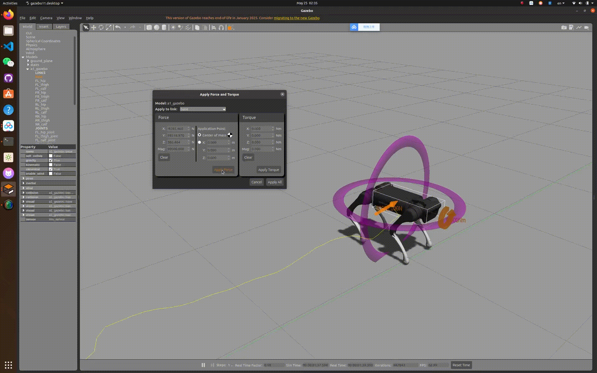

# 概述与使用方法
Unitree A1机器人的模型预测控制器（MPC）。

该MPC控制器基于以下开源项目：
1. MIT Cheetah的单刚体动力学方程
2. Quadprog++求解器
3. Unitree的开源项目[Unitree_Guide](https://github.com/unitreerobotics/unitree_guide/tree/main/unitree_guide)，用于模型和数据接口。
 
控制器代码位于[State_MPC.cpp](https://github.com/PMY9527/MPC-Controller-for-Unitree-A1/blob/main/src/FSM/State_MPC.cpp)和[State_MPC.h](https://github.com/PMY9527/MPC-Controller-for-Unitree-A1/blob/main/include/FSM/State_MPC.h)。

## 注意事项
这是一个面向四足机器人的基础MPC控制器实现。

## 运行环境
我的环境是ROS Noetic和Ubuntu 20.04，但在ROS Melodic和Ubuntu 18.04上也应该可以正常运行。

## 依赖项
与unitree_guide一样，您需要以下依赖：
1. [unitree_guide](https://github.com/unitreerobotics/unitree_guide/tree/main/unitree_guide)
2. [unitree_ros](https://github.com/unitreerobotics/unitree_ros)
3. [unitree_legged_msgs](https://github.com/unitreerobotics/unitree_ros_to_real)（注意：unitree_legged_real包不应作为依赖项的一部分）

将这三个包放在ROS工作空间的src文件夹中。将我的项目粘贴到'~\您的项目名称\src\unitree_guide\unitree_guide'目录下，并替换重复的文件。

## 运行方法
1. 进入项目文件夹：
```cd 您的项目名称```
2. 构建工作空间：
```catkin build```
3. 激活工作空间环境：
```source devel\setup.bash```
4. 打开Gazebo仿真器：
```roslaunch unitree_guide gazeboSim.launch```
5. 加载控制器：
```sudo ./devel/lib/unitree_guide/junior_ctrl```
   
启动控制器后，机器人将躺在仿真器的地面上，然后按键盘上的'2'键将机器人的有限状态机（FSM）从Passive（初始状态）切换到固定站立状态，再按'6'键将FSM从FixedStand状态切换到MPC状态。现在您可以按'w' 'a' 's' 'd'键控制机器人的平移运动，按'j' 'l'键控制机器人的旋转运动。按空格键，机器人将停止并站立在地面上。（如果没有响应，您需要点击启动控制器的终端窗口，然后重复之前的操作）

## 测试基准
1. 在10个预测时域下运行频率约为300 Hz
2. 能够以较高成功率攀爬高度5厘米、长度20厘米的台阶
3. 最高速度约为1.7 m/s

<div align="center" style="display: flex; justify-content: center; gap: 200px;">
  
  
</div>

## 潜在改进方向
为求解器添加热启动功能 + 坡度估计。